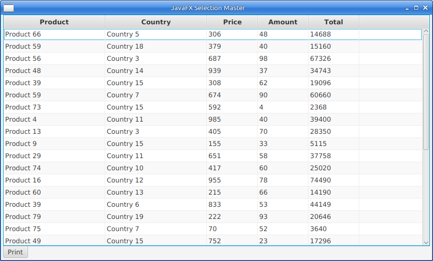

# JavaFXPrintingWithJasperReports
JavaFX How To: Printing from JavaFX application with JasperReports library

This project shows how to print data from tableView to html.
Hope it will be helpful.

It's how dialog looks like:

Button Print is used to create report.html, which can be opened with any html-viewer.
You can also export your reports into another format, such pdf, xlsx, ...
It requires some code modifications.
